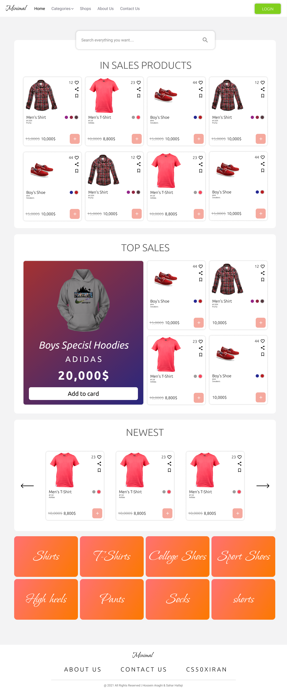
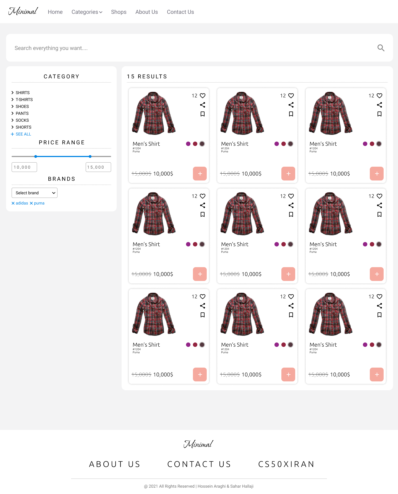
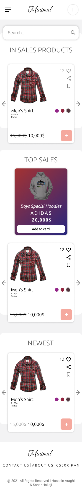
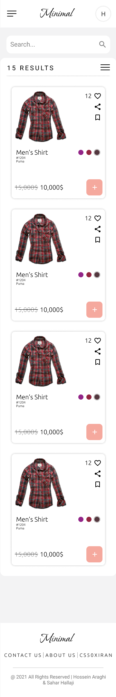
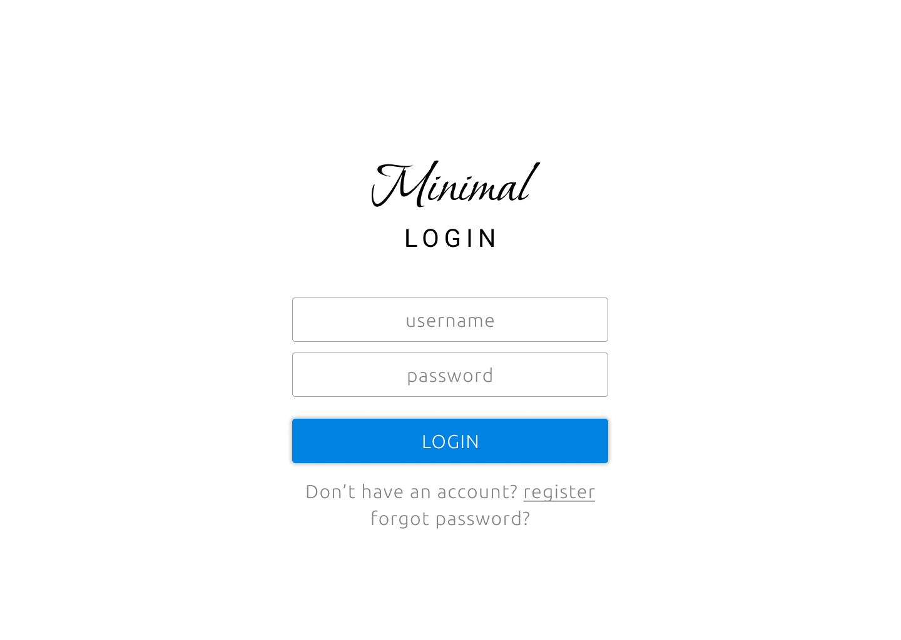
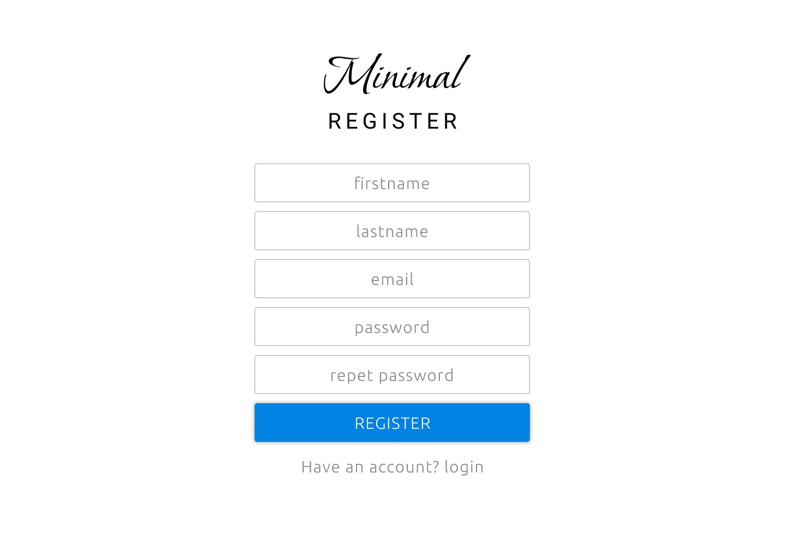
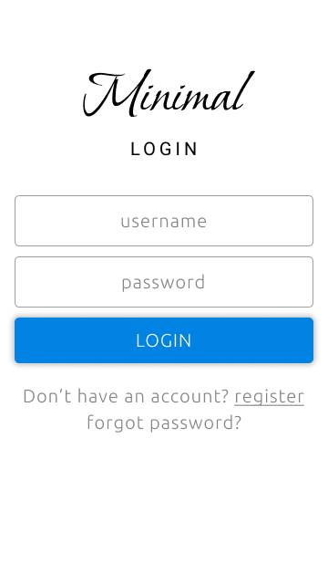
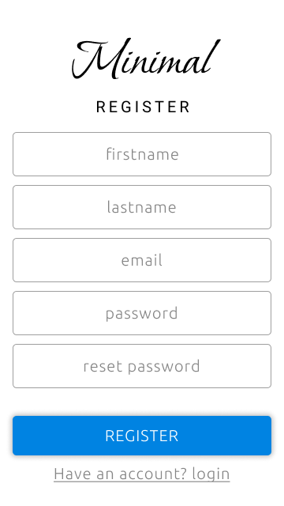
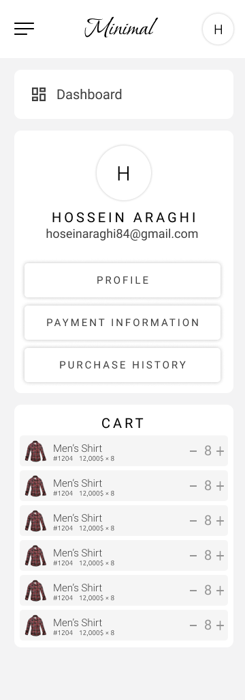
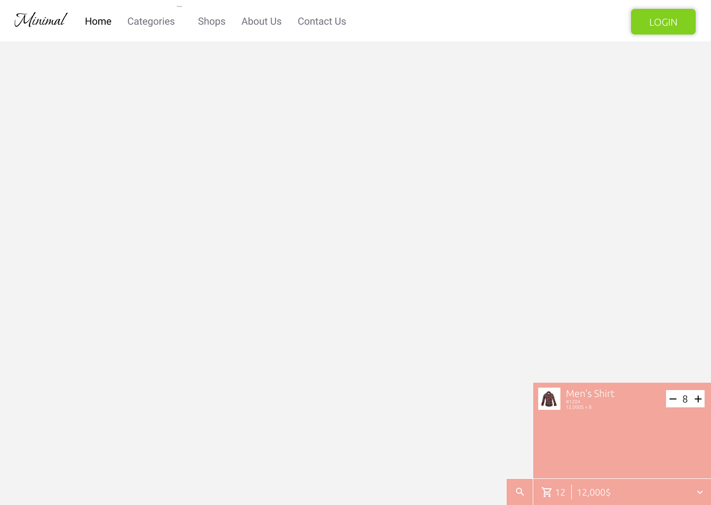

#  Minimal Project Documentation 

##فهرست

- قهرست
- شرح کلی
- نیازمندی ها

## شرح کلی

مینیمال یک market place آنلاین هست که فروشگاه ها می توانند محصولات خود را در سایت عرضه کنند و به فروش بگذارند. ایده این سایت ایده کاملی هست و تکنولوژی ساخت بسیار پیشرفته هست ولی به علت کمبود وقت پیاده سازی کامل انجام نشد. فروشگاه ها می توانند محصولات خود را ثبت، ادیت و حذف کنند و یا برای محصولات تخفیف در نظر بگیرند یا درخواست فروش ویژه بدهند. فروشگاه ها می توانند هزینه محصول را به صورت رمز ارز یا دلار دریافت کنند.

##نیازمندی ها

مینیمال از سه شخصیت ادمین، فروشنده و خریدار پشتیبانی میکند.

- ادمین :
  - لاگ کامل از وضعیت سایت
  - پاسخ تیکت ها
  - کنترل کامل پایگاه داده ها
- خریدار :
  - مشاهده محصولات 
  - اضافه و حذف محصولات در سبد خرید
  - تکمیل خرید و ثبت سفارش
  - تیکت دادن به پشتیبانی
  - دیدن سبد خرید
  - ثبت اطلاعات کارت
  - ویرایش پروفایل
  - اصافه یا حذف کردن عکس پروفایل
  - جستجو کردن محصول با فیلتر به صورت real time
  - کامنت گذاشتن برای محصول
  - دیدن فروشگاه های ثبت شده
- فروشنده :
  - اضافه، حذف، بروزرسانی محصول
  - پاسخ دادن یا گذارش کامنت
  - فروش ویژه و تخفیف
  - ثبت حساب کاربری
  - تمام کار های خریدار

##تکنولوژی ساخت

### بک اند

ما برای توسعه بک اند `spring boot` را به علت سرعت، قدرت، سادگی در پیاده سازی، کتاب خانه های فراوان، امنیت و پشتیبانی از reactor core انتخاب کردیم. به صورت کلی تکنولوژی های استفاده شده سمت بک اند سایت عبارت اند از :
`spring boot` `reactive spring` `spring web` `spring security` `spring web socket` `spring reactive mongoDB` 
`spring mail` `jwt`

و به عنوان زبان برنامه نویسی کاتلین رو انتخاب کردیم به علت سادگی، سرعت، خلاصه کردن تعداد زیادی تسک و امکانات زبان

###فرانت اند

ما برای توسعه فرانت اند از تکنولوژی vue.js 3 و vue cli 4 استفاده کردیم به علت سرعت، امنیت، جامعه گسترده، اینده دار بودن و... .
 ما در فرانت اند مینیمال از processor ها هم استفاده کردیم که عبارت اند از `type script` `pug` `sass` که دلیل این انتخاب امنیت کد، سرعت بیشتر و خطا کمتر در پیاده سازی بود.

###پایگاه داده

ما برای بخش پایگاه داده از MongoDB استفاده کردیم که دلیل این انتخاب سرعت شگفت انگیز، امنیت بالا، سیستم GridFS مناسب برای Big Data و NoSql بودن آن است.

##سناریو ها

###سناریو جذب کاربر
کاربر با ورود به صفحه اصلی سایت با المان های جذاب، تحریک به خرید می شود.

###سناریو جستجو
کاربر با ورود به صفحه جستجو از طریق دکمه پایین سایت می تواند محصول خود را جستجو کند. او می تواند نام محصول خود را جستجو کند و انها را بر اساس موارد موجود فیلتر کند و نتایج به صورت real time و با تکنولوژی web socket به کاربر نمایش داده می شود. با کلیک کردن روی نام محصول به صفحه ان محصول می رود و یا با کلیک بر روی علامت + می تواند آن محصول را به سبد خرید خود اضافه کند.

###سناریو سبد خرید
کاربر با دیدن محصولات در هر قسمت از سایت می تواند ان را به سبد خرید خود اضافه کند. سبد خرید در پایین صفحه و در داشبورد به کاربر نمایش داده می شوند که با زدن دکمه ثبت نهایی و طی کردن مراحل خرید، می توانند محصول را خریداری کنند.

###سناریو مراحل خرید
کاربر طبق روش بالا وارد صفحه می شود که در ابتدا اطلاعات حساب کاربری را از او میخواد . اگر کاربر در سایت وارد شده باشد اطلاعات به طور خودکار کامل شده است . بعد از آن وارد صفحه اطلاعات پرداخت می شود . اگر اطلاعات ثبت باشد اتوماتیک پر می شود . در غیر این صورت باید اطلاعات را ثبت کند . کاربر می تواند با استفاده از wallet خود یا کارت اعتباری محصول را خریداری کند . محصول خریداری شده در قسمت تاریخچه خرید ذخیره می شود.

###سناریو تیکت
کاربر می تواند از طریق بخش تیکت داشبورد هر مشکلی را با ادمین در میان بگذارد.

###سناریو ثبت نام
کاربر با وارد شدن صفحه ثبت نام باید اطلاعات خواسته شده را ثبت کند. تا اطلاعات کامل نباشد، دکمه ثبت نام قابل فشردن نیست. بعد از پر کردن فرم و زدن دکمه ثبت نام، ایمیلی به کاربر ارسال می شود. کاربر باید بر روی لینک ارسالی در ایمیل کلیک کنند تا حسابشان فعال شود . در غیر این صورت نمی توانند وارد حساب شوند.

###سناریو ورود
در صفحه ورود کاربر می توانند با وارد کردن ایمیل و رمز عبور خود وارد خساب کاربری خود شود و یا رمز خود را عوض کند . با زدن بر روی دکمه فراموشی رمز عبور، ایمیلی برای کاربر ارسال می شود. به محض ورود به لینک ارسالی در ایمیل حساب مسدود می شود و دیگر کسی نمی تواند وارد حساب شود تا زمانی که از طریق لیک رمز خود را عوض کند. بعد از وارد کردن رمز جدید و تکرار آن و فشردن دکمه submit. رمز عوض شده، حساب از مسدودی خارج شده و کاربر می تواند وارد حساب خود شود.

##رابط کاربری

##زمان بندی
این پروژه از تکنولوژی ساخت بالایی بر خوردار هست و ایده بسیار گسترده هست . با توجه به شروع شدن مدارس، زمان کم، دور کاری و تعداد تیم دو نفر طبیعتا نمی توان کل پروژه را پیاده سازی کرد. به صورت کلی ui این پروژه سه روز زمان برده و بقیه ui بداهه زده شده است. بقیه زمان به فرانت اند، بک اند و ux اختصاص پیدا میکند که به صورت موازی پیش برده شده است. دلیل موازی پیش بردن این بخش ها زمان کم بوده و سرعت در پروژه اهمیت زیادی داشته است. تقسیم وظایف پروژه به این صورت است که طراحی پروژه کار مشترک خانم فاطمه حلاجی و اقای حسین عراقی، فرانت اند کار مشترک خانم حلاحی و اقای حسین عراقی و بک اند کار اقای حسین عراقی هست.

##جمع بندی
امروزه رمز ارز ها بازار داغی دارد و یک market place که از رمز ارز ها پشتیبانی می کند برای فرشگاه ها محیط مناسب و نوینی برای کسب درآمد. ما تا آنجایی که مدرسه و دانشگاه اجازه بدهد زمان گذاشتیم و تمام تلاشمان را کردیم که بهترین کیفیت را ارایه بدهیم. تلاش کردیم در پیاده سازی پروژه از بهترین روش ها استفاده کنیم و با استفاده از آموخته های دوره cs50 پروژه ای شاید ناقص ولی با کیفیت بالا ارایه دهیم. امید واریم که نمره مناسبی کسب کرده باشیم.

###اجرا پروژه

بعد از نصب جاوا و مونگو دیبی بر روی سیستم خود پروژه را با تسک bootJar بیلد میکنید. فایل

/build/libs/minimal.jar 

را اجرا کرده و به api های زیر در خواست بزنید.

localhost:8080/api/rest/test/add/shop

یک بار

localhost:8080/api/rest/test/add/product

۱۶ بار

localhost:8080/api/rest/test/add/sp/testmail2@gmail.com

۱ بار

و با جستحو کردن localhost:8080 وارد سایت شوید.

